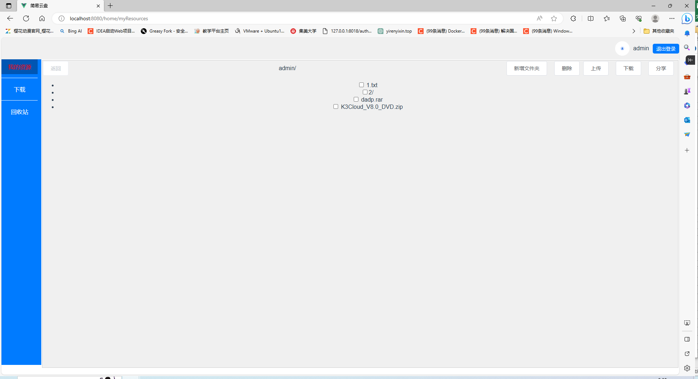
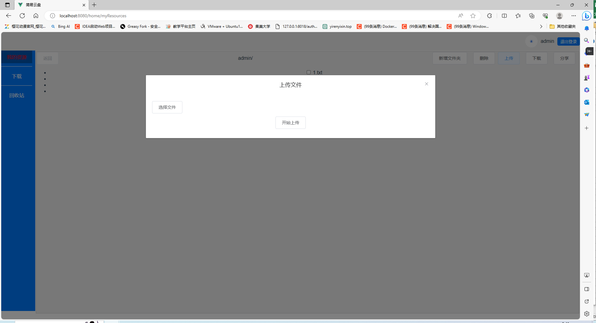
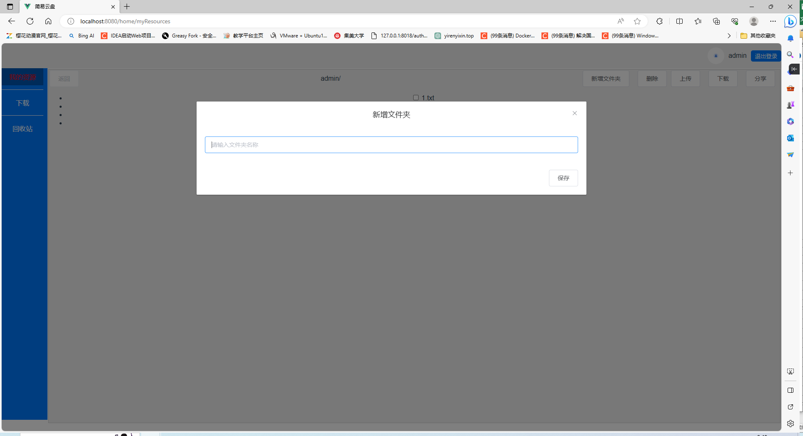
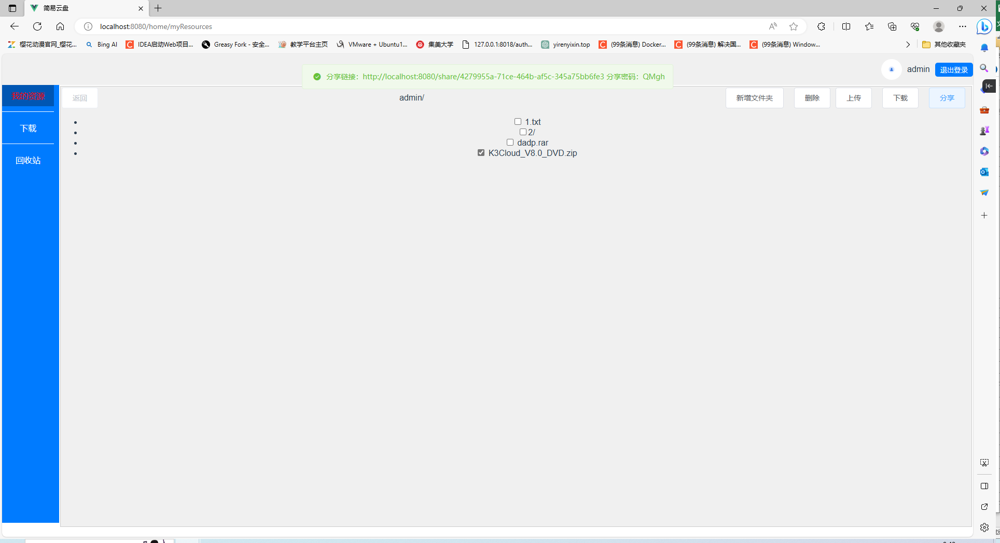
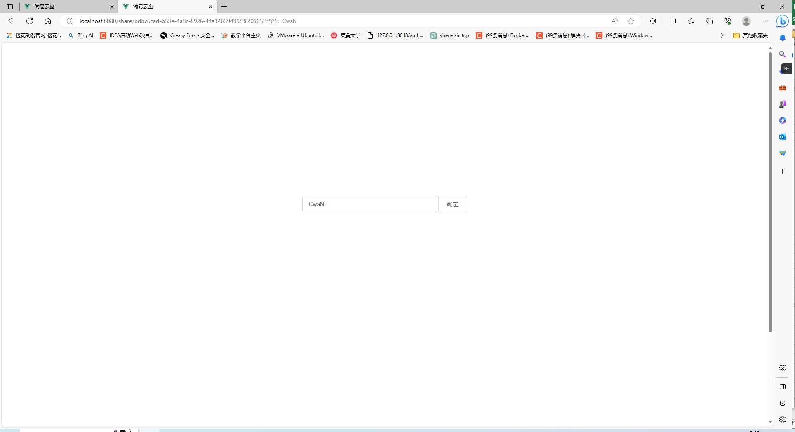
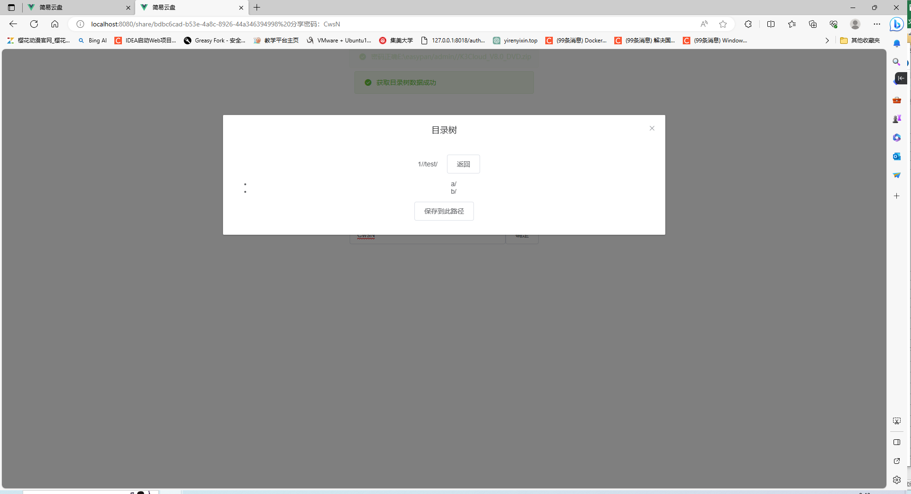
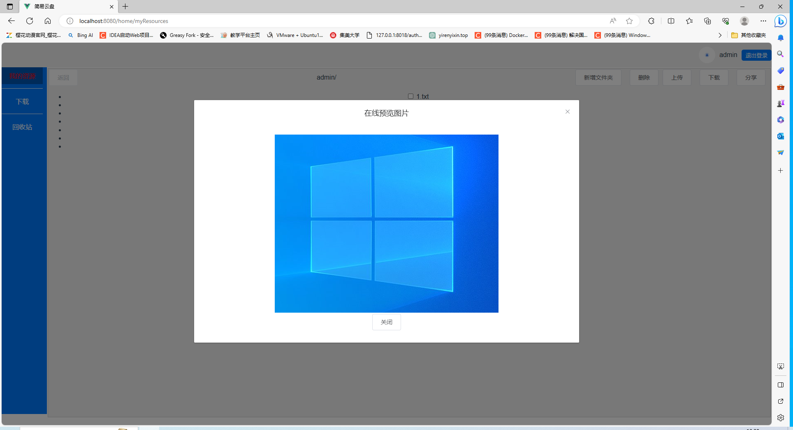

# 网盘前端代码

## 项目设置
```
npm install
```

### 编译并热重载以进行开发
```
npm run serve
```

### 为生产环境编译和压缩
```
npm run build
```

### 检查并修复文件
```
npm run lint
```

### 项目启动
````
#先运行npm install

npm install

#然后运行npm run serve然后根据提示打开相应网页

npm run serve
````

## 网盘前端代码

后端代码链接: https://github.com/yirenyixin/pan

## 实现的功能

文件分片上传，显示文件，文件下载，文件删除，新增文件夹，文件分享.

下载是直接托管给浏览器下载所以没有写下载界面


## 页面展示

我的资源



上传文件



新增文件夹



分享链接



分享页面



分享选择保存位置



在线预览图片



在线预览视频

